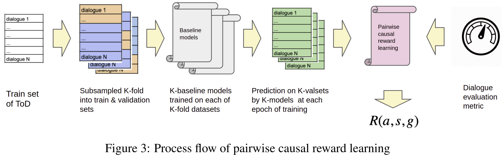

# Causal-aware Safe Policy Improvement for Task-oriented dialogue

This is the implementation of the paper:

**CASPI:Causal-aware Safe Policy Improvement for Task-oriented dialogue**. [[paper]](https://arxiv.org/abs/2103.06370)

## Citation:
If you use this code, data or our results in your research, please cite as below bibtex:
<pre>
@article{ramachandran2021causal,
  title={Causal-aware Safe Policy Improvement for Task-oriented dialogue},
  author={Ramachandran, Govardana Sachithanandam and Hashimoto, Kazuma and Xiong, Caiming},
  journal={arXiv preprint arXiv:2103.06370},
  year={2021}
}
</pre>


## Dependency
Run the following command to install dependencies
```console
pip install -r requirements.txt
```
## Data setup
Run the following command for data setup
```console
./damd_multiwoz/scripts/data_setup.sh
```

## Experiments


**Create K-fold datasets**

Please choose appropriate number of folds. In our work, we use 10 folds. larger the number of folds, larger number of model needs to be trained. For quick turn around smaller number of folds with marginal loss in performance.
```console
python CreateKFoldDataset.py --seed 111 --folds 10
```
**Generate dataset for pairiwse reward model**

Following script needs to be run K times, each time the value passed to --fold argument should be increment by 1 i.e between 0 and K-1 and prefereably with different seeds
```console
./damd_multiwoz/scripts/gen_reward_rollout.sh --cuda 0 --K 10 --fold 0 --metric soft --seed 68690
```

**Pairwise Reward Learning**

Please ensure the number of folds choosen matches with previous step 
```console
python RewardLearning.py --seed 11 --folds 10 --action_space act --gamma 0.0 --metric soft
```

**Estimate Behavior Policy**

Please ensure the number of folds, gamma and action_space match with reward learning step 
```console
python EstimateBehaviorPolicy.py --seed 111 --folds 10 --action_space act --gamma 0.0 --metric soft
```
**CASPI(MinTL),M_soft(act)**

In this version of CASPI, we use [**MinTL**](https://github.com/zlinao/MinTL) as the base model

Please ensure the argument --caspi_returns_file matches the choices made in previous steps. The file is of the form fn_Gs_<folds>_<gamma>_<action_space>_<metric>.json

```console
python train.py --mode train --context_window 2 --pretrained_checkpoint bart-large-cnn --gradient_accumulation_steps 8 --lr 3e-5 --back_bone bart --cfg seed=111 cuda_device=0 batch_size=8 early_stop_count=7 --caspi_returns_file=fn_Gs_10_0.0_act_soft.json --caspi_wt=5. --caspi_data_file=data_for_damd.json --caspi_val_fraction=.5 --caspi 
```
**CASPI(DAMD),M_soft(act) End-to-end**


In this version of CASPI, we use [**DAMD**](https://gitlab.com/ucdavisnlp/damd-multiwoz) as the base model. This script is to test end-to-end performance. Please ensure the arguments matches the choices made in the reward learning steps
    
```console
./damd_multiwoz/scripts/caspi_damd.sh --cuda 0 --seed 111 --K 10 --gamma 0.0 --policy_loss L_det,L_sto --action_space act --metric soft --train_e2e True
```
    
**CASPI(DAMD),M_soft(act) dialogue-context-to-text**
    
In this version of CASPI, we use [**DAMD**](https://gitlab.com/ucdavisnlp/damd-multiwoz) as the base model. This script is to test only dialogue-context-to-text generation task of Multiwoz2.0 . Please ensure the arguments matches the choices made in the reward learning steps
    
```console
./damd_multiwoz/scripts/caspi_damd.sh --cuda 0 --seed 111 --K 10 --gamma 0.0 --policy_loss L_det --action_space act --metric soft --train_e2e False
```
## Acknowledgement
This code extends or uses following prior codebase and data:
* [**MinTL**](https://github.com/zlinao/MinTL).
* [**DAMD**](https://gitlab.com/ucdavisnlp/damd-multiwoz).
* [**Multiwoz2.0**](https://github.com/budzianowski/multiwoz).
* [**ConvLab Multiwoz2.0 annotation**](https://github.com/ConvLab/ConvLab/tree/master/data/multiwoz/annotation).

## More Information
Please refer the [[paper]](https://arxiv.org/abs/2103.06370) and feel free to reach out to us.

